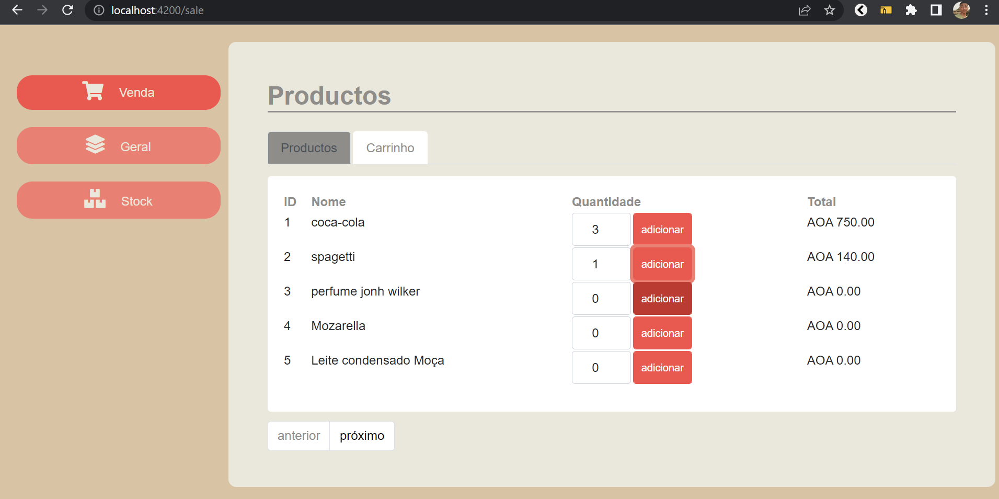
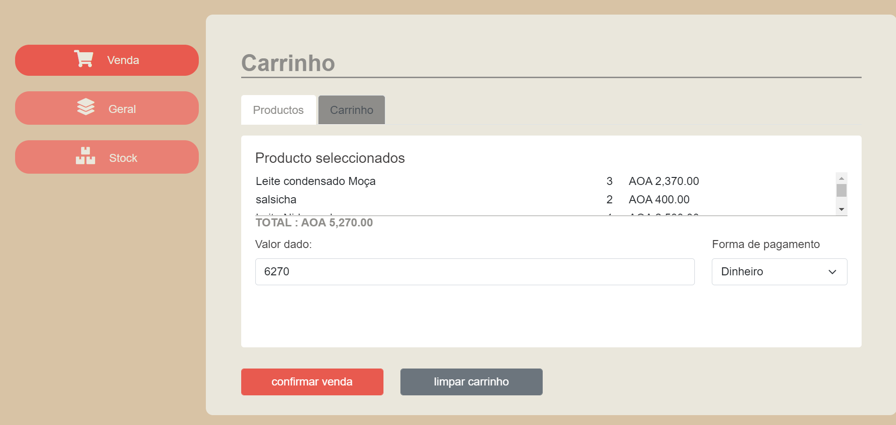
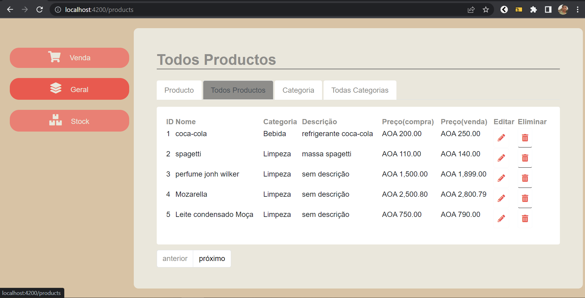

# FullStack App ( Spring + Angular ) : Newspaper Management System 

## Application for stores management built using kotlin, spring boot and Angular

###### `The App has the following features:`

1. shopping cart
2. invoice generator 
3. Stock control
4. Products CRUD

### To Buid Frontend was used:

1. Node js
2. Typescript
3. Angular 13
4. Material UI 13

### To Buid Backend was used:

1. Spring Web
3. Spring Data
4. Spring Heteoas
6.  MySQL (DB)
7. TDD(Pattern)
8. DDD(Pattern)

# 	Requirements to run on Localhost

1. **Java Jdk** ( **8** )
2.  **IntelliJ IDEA**  :  Backend
3. **VScode**:  Frontend
5. **Node Js & npm**
6. **TypeScript**
7. **Angular CLI** 
8. **MySQL 8**
9. **Maven**

<h3> Screenshots: <h3>

 
    
    
    

